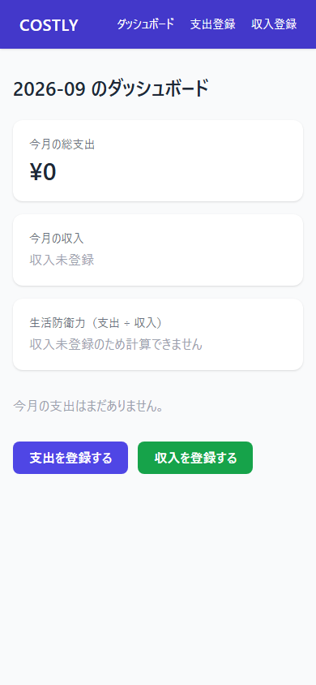

# costly-py

現役調理師としての「原価率管理」の実務経験を、家計管理（食費・生活費）に応用したパーソナルファイナンスアプリ。COSTLY（Java/Spring Boot版）のコンセプトを継承し、Python/FastAPIで新規に実装した。

RaiseTech初級編 最終課題として、要件定義〜AWSデプロイまでを一人で実施した。想定利用者は開発者本人のみ（1ユーザー）で、ログイン・認証機能は持たない。詳細は[要件定義書](docs/requirements.md)を参照。

## 主な機能

- 支出登録：費目・金額・日付を記録する
- 収入登録：月ごとの収入を記録する
- ダッシュボード：
  - 生活防衛力（＝支出 ÷ 収入 × 100）を算出・表示
  - 今月の総支出・費目別の内訳表示

## 画面イメージ




## 技術スタック

| レイヤー | 技術 |
|---|---|
| バックエンド | Python 3.12 + FastAPI |
| フロントエンド | Jinja2（サーバーサイドレンダリング） + Tailwind CSS |
| データベース | MySQL 8.4 |
| ORM / マイグレーション | SQLAlchemy / Alembic |
| インフラ | AWS EC2、Terraform |
| バージョン管理 | Git / GitHub |

前回のTrello風アプリ（React/TS/Vite/Tailwind + Java/Spring Boot/Gradle/PostgreSQL）とは異なる技術スタックとする方針で選定した。

## ディレクトリ構成

```
├── main.py         # FastAPIアプリのエントリーポイント
├── models.py       # SQLAlchemyモデル（Expense / Income）
├── schemas.py      # Pydanticスキーマ
├── database.py     # DB接続設定（.envからDB_URLを読み込み）
├── routers/        # APIエンドポイント（expenses / incomes）
├── crud/           # DB操作ロジック
├── templates/      # Jinja2テンプレート（画面）
├── alembic/        # DBマイグレーション
├── terraform/      # AWSインフラ構築（EC2・VPC・セキュリティグループ）
├── docs/           # 要件定義書
├── start.sh / stop.sh  # EC2上でのuvicorn起動・停止スクリプト
└── requirements.txt
```

## ローカルでの起動

必要なもの：Python 3.10以上、MySQL

```bash
git clone https://github.com/Yusuke2000-hub/costly-py.git
cd costly-py
python -m pip install -r requirements.txt
cp .env.example .env      # DB_URLを自分のMySQL環境に合わせて設定する
python -m alembic upgrade head   # テーブルを作成する
python -m uvicorn main:app --reload
```

ブラウザで http://localhost:8000 を開く（API仕様は http://localhost:8000/docs で確認できる）。

## AWSへのデプロイ

EC2上にMySQLとFastAPIアプリを構築し、TerraformでVPC・サブネット・セキュリティグループ・EC2インスタンスを管理している。構成の詳細は[要件定義書](docs/requirements.md)を参照。

| 内容 | コマンド（`terraform/`で実行） |
|---|---|
| 構築する | `terraform init` → `terraform plan` → `terraform apply` |
| すべて削除する | `terraform destroy` |

EC2上でのアプリの起動・停止：

```bash
./start.sh   # バックグラウンドでuvicornを起動
./stop.sh    # 停止
```

## 開発で苦労した点

環境構築・デプロイ周りで踏んだトラブルシューティング（MySQL認証トラブル、Terraformのuser_dataスクリプトのサイレント障害など）は、こちらの記事にまとめている。

[FastAPI×MySQLをEC2にデプロイして踏んだ、3つの地味だけど痛い落とし穴](https://zenn.dev/yusuke2000_hub/articles/874dfe0a142f5a)

## ドキュメント

| ドキュメント | ファイル | 内容 |
|---|---|---|
| 要件定義書 | [docs/requirements.md](docs/requirements.md) | 機能要件・非機能要件、技術選定 |
| 画面設計書 | [docs/screens.md](docs/screens.md) | 各画面の目的・入力項目 |
| DB設計書 | [docs/db-design.md](docs/db-design.md) | テーブル定義・ER図 |
| API設計書 | [docs/api-design.md](docs/api-design.md) | エンドポイント仕様 |
| インフラ構成書 | [docs/infrastructure.md](docs/infrastructure.md) | AWS構成図・プロビジョニング |

## 現在の進捗状況

- [x] 要件定義
- [x] バックエンドAPI実装（支出・収入のCRUD）
- [x] データベース設計・マイグレーション（Alembic）
- [x] AWS（EC2）へのデプロイ
- [x] 環境変数（.env）による設定管理
- [x] フロントエンド（ダッシュボード・支出登録画面）
- [ ] ゲーム化要素（メダル・コーチキャラ）：将来拡張として要件定義書に記載、今回はスコープ外
